## 1. 考试概要介绍

- 考试形式

  - 计算机与软件工程知识
    - 150分钟，笔试，75道选择题（每空一分，合格45分）
  - 软件设计
    - 150分钟，笔试，问答题（数据流、数据库、UML、算法、面向对象编程（C++和Java二选一，以设计模式为背景））

- 知识点及分值

  

## 2. 计算机组成原理

### 2.1 进制转换

- R进制  --> 十进制

- 十进制  --> 二进制

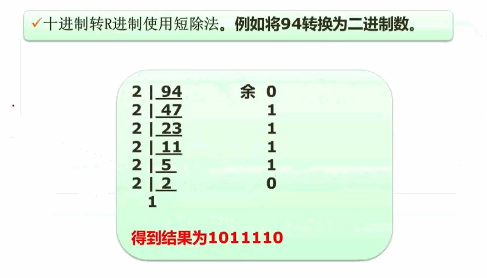

- 二进制  <--> 八/十六进制

### 2.2 数据的表示（原、反、补和移码）

- 移码：对补码的最高位取反得到
- 数值表示范围

- 补码比原码多一个范围原因：补码中正0和负0共用一个表示。

### 2.3 浮点数运算

- 浮点数运算及步骤

- 对阶：以高位的为准，使两个浮点数的指数相等。
- 结果格式化：
  - 尾数整数部分只能为1位
  - 尾数整数部分不能为0
  - 例子：1.19 x 10²

### 2.4 计算机结构

- 计算机结构图

- 累加寄存器AC：通用寄存器，用于存储运算相应的值（不仅仅是加法运算）。
- 数据缓冲寄存器DR：对内存储器进行读写操作时，用来暂存数据。
- 状态条件寄存器PSW：用来存储在运算过程中相关的状态标志位（进位、溢出和中断等）。
- 程序计数器PC：用来存放下一条执行指令地址（若顺序执行，则在原指令地址加1；若涉及跳转，则需要加多几个）。

### 2.5 Flynn分类法

- Flynn分类下的计算机体系结构图

### 2.6 CISC与RISC

- 指令系统类型

### 2.7 流水线

#### 2.7.1 概念

#### 2.7.2 指令执行过程

#### 2.7.3 流水线周期及执行时间计算

- 流水线周期：取值、分析和执行三个阶段时间最长的一段。
- 理论公式中 tn 为第一条指令中第n个步骤的执行时间。
- 实践公式中k为一个指令的执行步骤个数，n为流水线中要执行的指令个数。
- 注意：考试通常优先使用理论公式，若找不到解则使用实践公式。

#### 2.7.4 流水线吞吐率计算

- 吞吐量计算公式

- 最大吞吐率公式

#### 2.7.5 流水线的加速比及效率计算

- 加速比计算公式

- 效率计算公式

### 2.8 层次化存储结构

- 层次化存储结构图

### 2.9 Cache

- 概念

- 引入Cache后系统的平均周期计算公式

### 2.10 局部性原理

- 概念

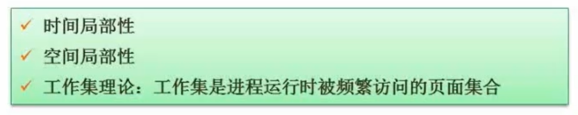

- 时间局部性原理：程序执行过程在短期时间内频繁访问同个内存空间。
- 空间局部性原理：程序执行过程频繁访问某一片临近的内存空间。

### 2.11 主存

- 主存分类

- 主存编址

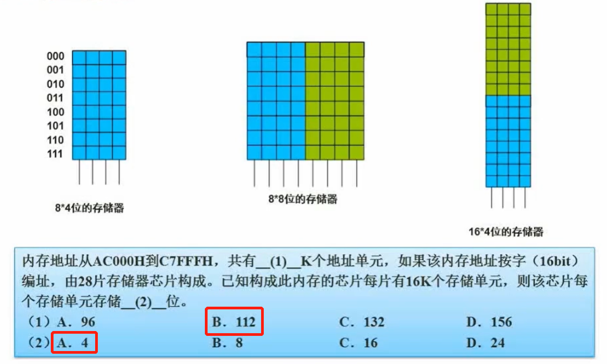

### 2.12 磁盘工作原理

- 磁盘结构与参数

- 试题

- 题解

1. 顺序处理

2. 优化处理
   - t = 11 x (3+3) = 66ms

### 2.13 总线

- 分类

- 内部总线：微机内部各个外围芯片与处理器之间的总线。
- 系统总线：微机中各个插件板和系统板的总线（PCI，VGA）。

### 2.14 系统可靠性分析

#### 2.14.1 串联系统

- 其中R为可靠度，λ为失效率。

#### 2.14.2 并联系统

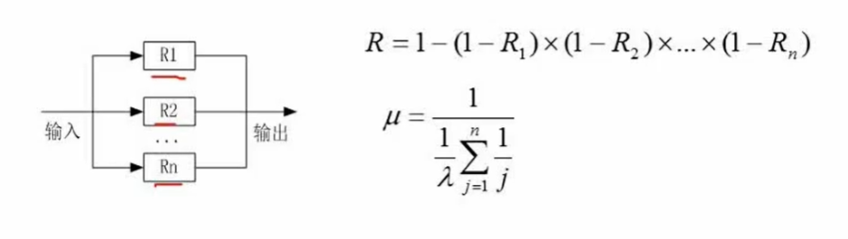

- 上述μ的计算公式过于复杂，可以使用 μ = 1 - R 方法计算得出。

#### 2.14.3 模冗余系统与混合系统（几乎不考）

- 例题

### 2.15 校验码

#### 2.15.1 概念

- 什么是检错和纠错？
  - 检错：检测出错误
  - 纠错：检测出错误之后能进一步纠正
- 什么是码距？
  - 一个编码系统的码距是整个编码系统中任意（所有）两个码字的最小距离。（简单来说，就是一个码改变x个位可以变成另一个码，x为码距）
- 码距与检错、纠错的关系

#### 2.15.2 CRC循环校验码（只能检错）

- 原理：对原始报文后面加上n个0，然后与生成**多项式对应的n位二进制数**进行模2除法，然后在原始报文加上余数（n位）生成校验码，此时校验码除以**多项式对应的二进制数**结果为0。（通过结果检测报文是否有差错）。
- 模2除法中间值不是相减，而是做异或运算。

- 例题

#### 2.15.2 海明校验码（可以检错和纠错）

- 原理：在第 2^n 位上放置校验位（校验位通过**校验位公式**计算得出），其他的做信息位。收到报文之后，使用报文的信息位生成**新校验位**，再使用报文中的校验位与**新校验位**做异或运算，再将二进制结果转为十进制d，代表报文中第d位出错，此时将其取反则可以得到正确的报文。
- 信息位数 x 与校验位  r 的关系
  - 2^r >= x + r + 1

- 例题（包含校验位公式）

## 3. 操作系统（5~7分）

### 3.1 概述

### 3.2 进程管理

#### 3.2.1 进程的状态及转换

#### 3.2.2 前趋图

#### 3.2.3 进程的同步与互斥

- 互斥：指的是同一时间内只能有一个线程去访问特定资源。
- 同步：指的是多个线程操作以一定的时序进行。

#### 3.2.4 PV操作

- 概念

- 单缓冲区生产者、消费者例子

   注：其中S1为缓冲区空闲空间的大小，S2为缓冲区产品的数量。

- 例题

#### 3.2.5 PV操作与前趋图

- 例题

#### 3.2.6 死锁问题

- 概念

注：n个进程，每个进程需要x个资源，至少需要 **n(x-1)+1** 个资源才不可能发生死锁。

- 死锁预防与避免

#### 3.2.7 银行家算法

- 概念

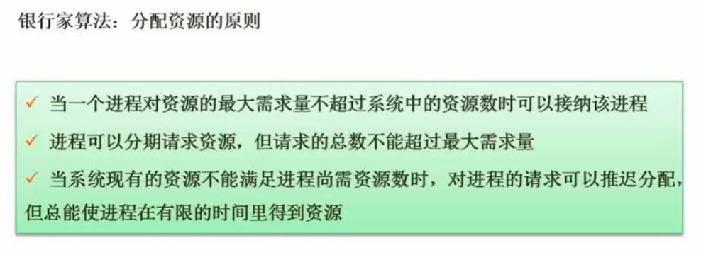

- 例题

### 3.3 存储管理

#### 3.3.1 分区存储组织

#### 3.3.2 页式存储组织

- 例题

#### 3.3.3 段式存储组织

#### 3.3.4 段页式存储组织

#### 3.3.5 快表

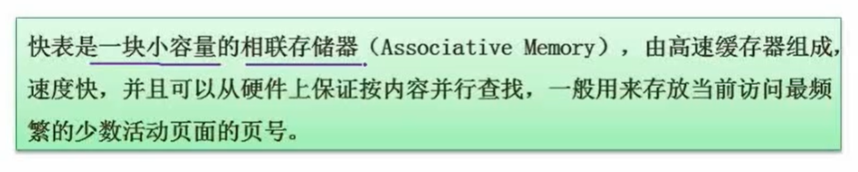

#### 3.3.6 页面置换算法

- 常见算法

- 抖动现象

- 例题

- 练习题

注：当一条指令存储在多个页面时，调入内存只会产生一次缺页中断，而操作数则是一个页面产生一个缺页中断。

### 3.4 文件管理

#### 3.4.1 索引文件结构

#### 3.4.2 文件和树型目录结构

 

#### 3.4.3 空闲存储空间的管理

- 例题

注：考试默认字从**1**开始，位从**0**开始。

### 3.5 设备管理

#### 3.5.1 数据传输控制方式

#### 3.5.2 虚设备与SPOOLING技术

### 3.6 微内核操作系统

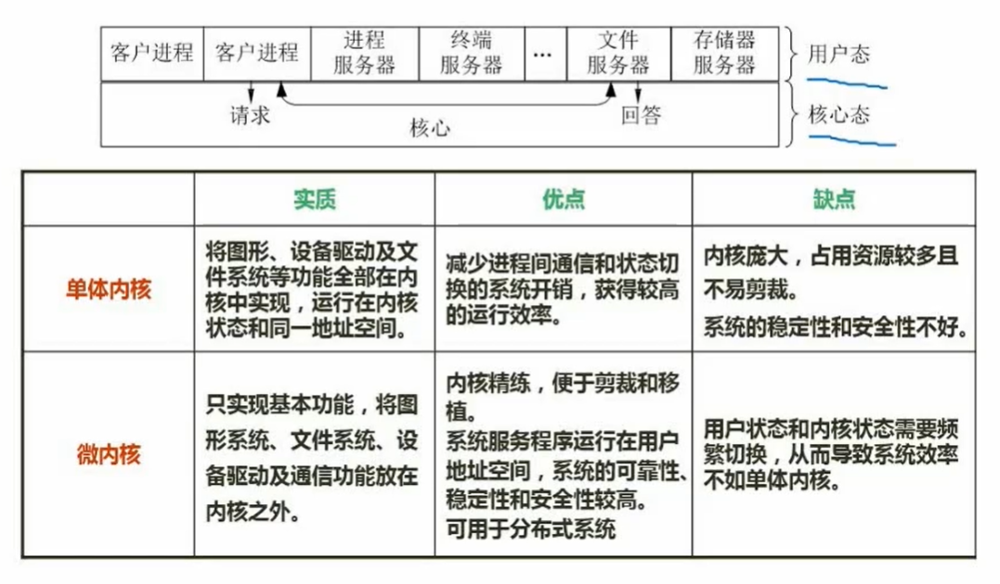

## 4. 数据库系统

### 4.1 三级模式—两级映射

### 4.2 数据库设计过程

### 4.3 E-R模型

- 概念

- E-R图集成方法、冲突及解决办法

- 例题

### 4.4 关系代数（选择题）

#### 4.4.1 交、并、差

- 交：选择相同部分
- 并：合并之后去除重复部分
- 差：去除相同部分

#### 4.4.2 笛卡尔积

#### 4.4.3 投影、选择

- 投影：列出特定列
- 选择：列出特定行
- 注：这里可用数值代表投影或选择第几个字段

#### 4.4.4 联接

- 与笛卡尔积不同之处：相同的字段只会保留一个，且需要指明连接条件，若没有指明连接条件且只有一个相同的字段，则默认选择该字段作为条件进行连接。

### 4.5 规范化理论

#### 4.5.1 函数依赖

#### 4.5.2 价值与用途

#### 4.5.3 键

- 概念

注：超键和候选键的区别：超键存在多余属性

- 求候选键

- 例题

#### 4.5.4 范式

- 概念

 

- 第一范式

- 第二范式

- 第三范式

- BC范式

注：满足BC范式的函数依赖的左边部分都是候选码（上图T->J不符合条件，因为T不是候选码，候选码有ST、SJ）。

- 例题

#### 4.5.5 模式分解

- 保持函数依赖分解

注：分解之后的R1、R2...Rn包含原来的R的所有函数依赖。

- 无损分解

- 判别无损分解的方法

1. 列表法

注：红色表示分解之后的各关系中的属性，若能通过其他关系补全则说明为无损分解。

2. 集合推导

注：该方法只适合两个属性分解的情景，根据条件推导出R1->R2和R2->R1，若有其中一个属于函数依赖中的一项，则为无损分解。

### 4.6 并发控制

- 概念

- 存在的问题

- 封锁协议

### 4.7 完整性约束

### 4.8 数据库安全

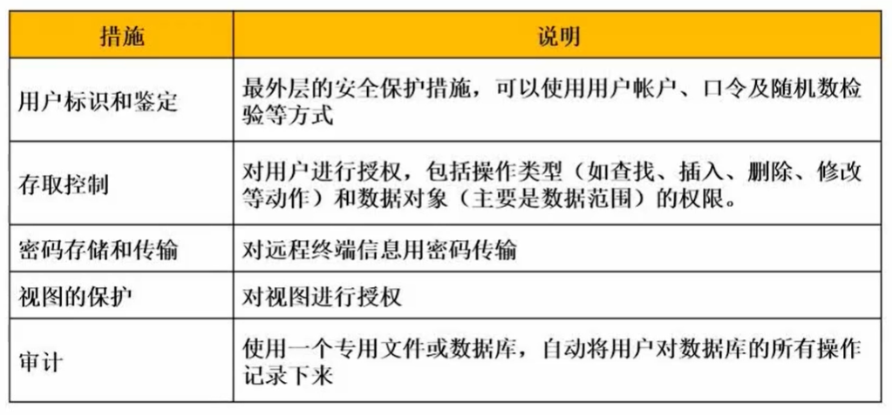

### 4.9 数据备份

注：差量备份是相对于完全备份。

### 4.10 数据库故障与恢复

### 4.11 数据仓库与数据挖掘

### 4.12 反规范化

### 4.13 大数据

## 5. 计算机网络

### 5.1 七层模型

- 概念

- 例题

注：全局广播只能在局域网中，所以在网络层及以上使用的设备都不能通过。

### 5.2 网络技术标准与协议

#### 5.2.1 概念

- Samba、CIFS和NFS三种协议可以使用TCP和UDP实现。

#### 5.2.2 DHCP协议

- 当分配到**169.254.X.X**或**0.0.0.0**时说明IP分配失败，因为上述两个IP均为假IP，不能用于互联网通信。

#### 5.2.3 DNS协议

- 迭代查询：由目标客户机请求本地域名服务器，然后本地域名服务器分别从根域名服务器、顶级域名服务器、权限域名服务器等自顶向下查询域名对应的IP地址。

- 递归查询：由目标客户机请求本地域名服务器，然后本地域名服务器请求根域名服务器，根域名服务器请求下一层的顶级域名服务器，逐步向下层查询直到查询到为止，查询之后逐层返回查询结果。

- 例题

#### 5.2.4 TCP协议

### 5.3 网络类型与拓扑结构

### 5.4 网络规划与设计

#### 5.4.1 逻辑网络设计

#### 5.4.2 物理网络设计

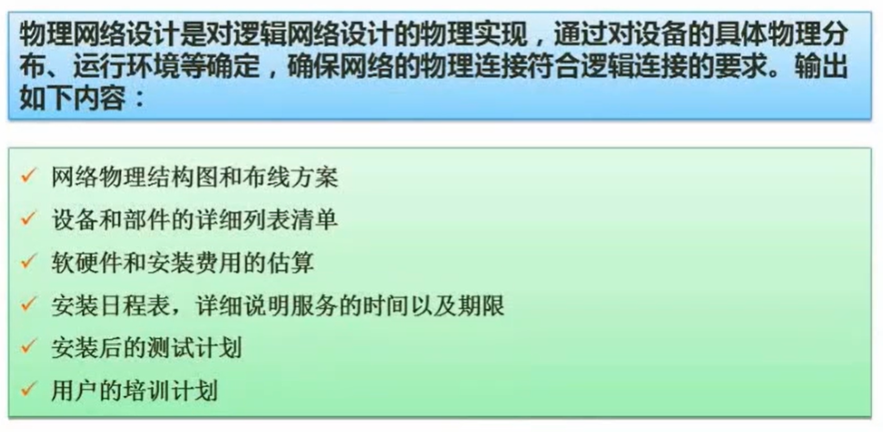

#### 5.4.3 分层设计

### 5.5 IP地址与子网划分

#### 5.5.1 IP地址分类

注：全0和全1地址一般不使用，计算地址数量时需减2。

#### 5.5.2 子网划分

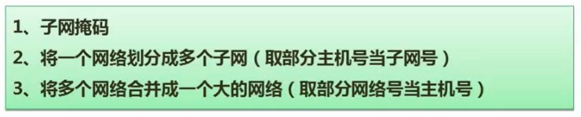

注：子网号可以使用全0和全1。

- 例题

#### 5.5.3 无分类编址（无类域间路由）

- 例题

#### 5.5.4 特殊含义的IP地址

### 5.6 HTML

### 5.7 无线网

### 5.8 网络接入技术

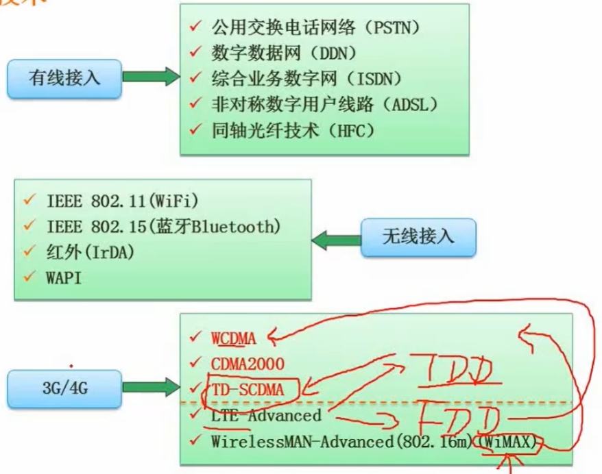

- TDD为时分复用技术（基于TD-SCDMA），FDD为频分复用技术（基于WCDMA）。

### 5.9 IPv6

## 6. 系统安全分析与设计

### 6.1 信息系统安全属性

### 6.2 对称加密与非对称加密

- 对称加密技术

- 非对称加密技术

### 6.3 信息摘要

### 6.4 数字签名

### 6.5 数字信封与PGP

- 练习题

### 6.6 网络安全

#### 6.6.1 各个网络层次的安全保障

注意：SSL适用于多个网络层级。

#### 6.6.2 网络威胁与攻击

#### 6.6.3 防火墙

## 7. 数据结构与算法

### 7.1 数组

- 例题

  答：存储地址=a + (5 x 2 + 3) x 2 = a + 26。

### 7.2 稀疏矩阵

- 例题

注：推荐使用代入法求解。

### 7.3 数据结构的定义

### 7.4 线性表

#### 7.4.1 顺序表和链表

注：主要掌握单链表结点的操作步骤。

#### 7.4.2 顺序存储与链式存储

#### 7.4.3 队列与栈

1. **tail**指针在最后一个元素的下一位。

2. 为避免队空和队满的条件一致，即**head=tail**，通常最后一个空间不存放元素。

- 例题

注：推荐使用排除法和代入法解题。

### 7.5 广义表

1. **表尾**是除了第一个表元素的所有元素的组合。
2. **宽度**为表元素的个数，**深度**为括号嵌套的次数。

3. 取出元素时通过**head**和**tail**步骤进行逐层取出。

### 7.6 树与二叉树

#### 7.6.1 基本概念

1. 结点的度：当前结点的子结点个数
2. 树的度：所有结点的度的最大值
3. 叶子结点：没有子结点的结点
4. 分支结点：含有分支的结点
5. 内部结点：非根结点与叶子结点的结点（中间的结点）
6. 父、子结点：相对于某几个结点而言
7. 兄弟结点：相对于某几个结点而言，两个结点处于同一层且归属于同个父节点

#### 7.6.2 满二叉树与完全二叉树

1. 满二叉树：每个非叶子结点都含有两个子结点
2. 完全二叉树：结点以广度优先的方式进行放置，最后一层可能不放满

#### 7.6.3 二叉树遍历

1. 前序遍历：根->左->右
2. 中序遍历：左->根->右
3. 后序遍历：左->右->根
4. 层次遍历：一层一层由左到右进行遍历

#### 7.6.4 反向构造二叉树（主要考察前中/中后序推出二叉树）

1. 先从前序/后序遍历确定根结点，再结合中序遍历确定左右结点
2. 重复以上步骤，直到确定全部结点

#### 7.6.5 树转二叉树

#### 7.6.6 查找二叉树

#### 7.6.7 最优二叉树（哈夫曼树）

1. 树的路径长度：树的所有路径长度之和
2. 权：在结点上有一个数值代表某一种字符出现的频度

3. 带权路径长度：（结点距离根节点的路径长度）*权值

4. 树的带权路径长度（树的代价）：树每个结点（叶子结点）的带权路径长度之和

#### 7.6.8 线索二叉树

- 线索二叉树：利用结点中的空指针位置放置特定遍历方式的前驱（左指针）和后继（右指针）结点的地址。

#### 7.6.9 平衡二叉树

- 平衡二叉树：保证每个结点的**平衡度**只能为**-1**、**0**或**1**，**平衡度=左子树深度 - 右子树深度**。

### 7.7 图

#### 7.7.1 基本概念

#### 7.7.2 图的存储

- 邻接矩阵

- 邻接表

#### 7.7.3 图的遍历

#### 7.7.4 拓扑排序

#### 7.7.5 最小生成树

- 普里姆算法

1. 选取一个点放入一个集合
2. 计算该集合中各个点到其他未连接的点的距离
3. 选择最小距离的点，连接，并将其放入集合中
4. 重复第2-3步骤直到所有的点均已连接（注意：连接过程中不能形成环路）

- 克鲁斯卡尔算法

1. 找出未连接的最小距离的边
2. 连接
3. 重复第1-2步骤直到所有的点均已连接（注意：连接过程中不能形成环路）

### 7.8 算法基础

#### 7.8.1 算法的特性

#### 7.8.2 算法的复杂度

### 7.9 查找

#### 7.9.1 顺序查找

#### 7.9.2 二分查找

- 思想与步骤

- 例题

#### 7.9.3 散列表

- 线性探测法：若发生冲突则往下一个地址探测，直到找到第一个空的位置将其置入。

### 7.10 排序

#### 7.10.1 概念与分类

- 稳定排序与不稳定排序的区别：前者对于相等的元素不会改变原顺序，造成不必要的操作。

#### 7.10.2 直接插入排序

#### 7.10.3 希尔排序

#### 7.10.4 直接选择排序

#### 7.10.5 堆排序

- 堆的概念

- 初堆的建立

1. 从后到前选择分支结点对应的子树，对比其根节点与子节点的大小，按照条件进行交换；
2. 交换过程如果使得其他子树不满足堆的条件也需要进行调整；
3. 重复以上步骤，直到所有子树满足堆的条件，即初堆构建完成。

- 堆排序

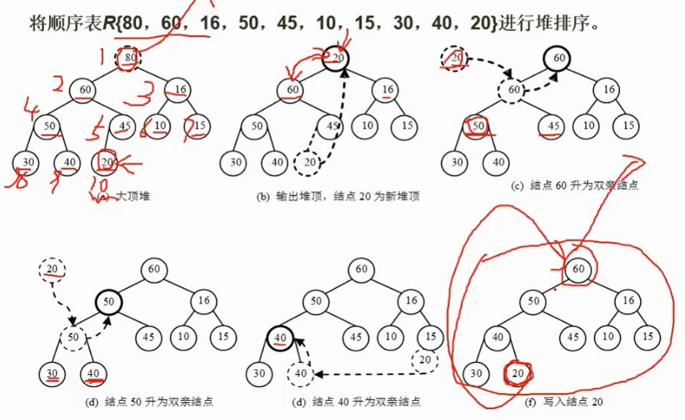

1. 取出最小/大的元素（即树的根节点），然后将最后一个结点移动到根结点；
2. 按照堆的条件对新形成的二叉树进行调整；
3. 重复以上步骤，直到所有元素均全部取出，即堆排序完成。

#### 7.10.6 冒泡排序

#### 7.10.7 快速排序

#### 7.10.8 归并排序

#### 7.10.9 基数排序

#### 7.10.10 排序算法的时间和空间复杂度

