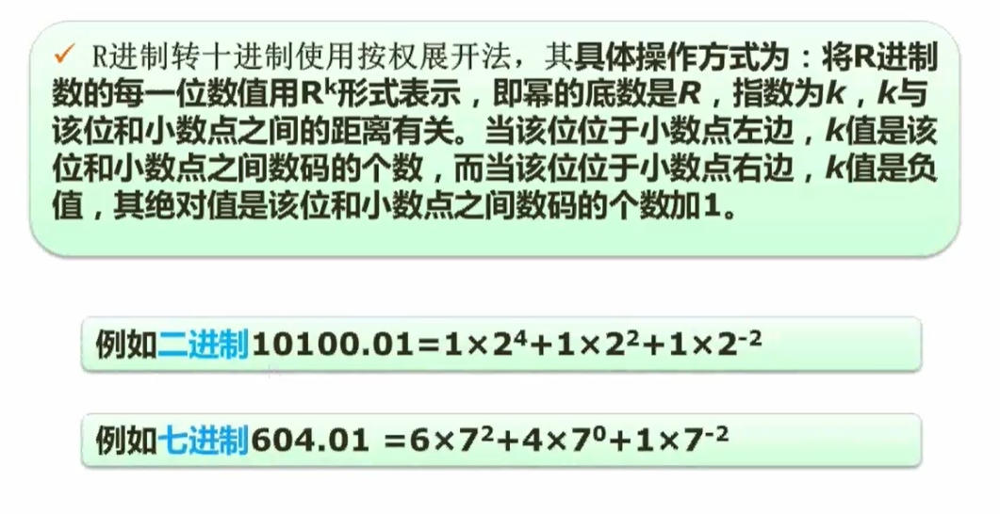
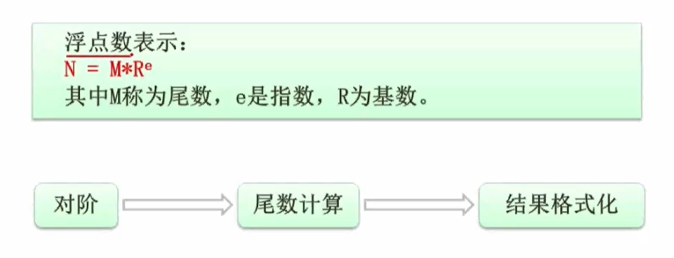
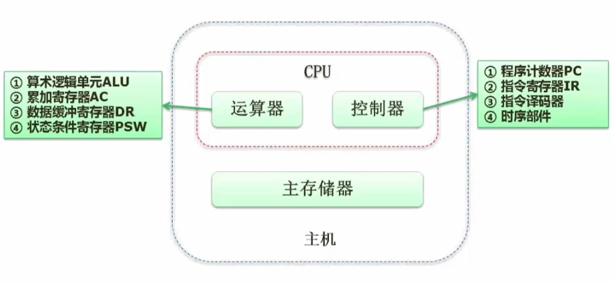

## 1. 考试概要介绍

- 考试形式

  - 计算机与软件工程知识
    - 150分钟，笔试，75道选择题（每空一分，合格45分）
  - 软件设计
    - 150分钟，笔试，问答题（数据流、数据库、UML、算法、面向对象编程（C++和Java二选一，以设计模式为背景））

- 知识点及分值

  

## 2. 计算机组成原理

### 2.1 进制转换

- R进制  --> 十进制

- 十进制  --> 二进制

- 二进制  <--> 八/十六进制

### 2.2 数据的表示（原、反、补和移码）

- 移码：对补码的最高位取反得到
- 数值表示范围

- 补码比原码多一个范围原因：补码中正0和负0共用一个表示。

### 2.3 浮点数运算

- 浮点数运算及步骤

- 对阶：以高位的为准，使两个浮点数的指数相等。
- 结果格式化：
  - 尾数整数部分只能为1位
  - 尾数整数部分不能为0
  - 例子：1.19 x 10²

### 2.4 计算机结构

- 计算机结构图

- 累加寄存器AC：通用寄存器，用于存储运算相应的值（不仅仅是加法运算）。
- 数据缓冲寄存器DR：对内存储器进行读写操作时，用来暂存数据。
- 状态条件寄存器PSW：用来存储在运算过程中相关的状态标志位（进位、溢出和中断等）。
- 程序计数器PC：用来存放下一条执行指令地址（若顺序执行，则在原指令地址加1；若涉及跳转，则需要加多几个）。

### 2.5 Flynn分类法

- Flynn分类下的计算机体系结构图

### 2.6 CISC与RISC

- 指令系统类型

### 2.7 流水线

#### 2.7.1 概念

#### 2.7.2 指令执行过程

#### 2.7.3 流水线周期及执行时间计算

- 流水线周期：取值、分析和执行三个阶段时间最长的一段。
- 理论公式中 tn 为第一条指令中第n个步骤的执行时间。
- 实践公式中k为一个指令的执行步骤个数，n为流水线中要执行的指令个数。
- 注意：考试通常优先使用理论公式，若找不到解则使用实践公式。

#### 2.7.4 流水线吞吐率计算

- 吞吐量计算公式

- 最大吞吐率公式

#### 2.7.5 流水线的加速比及效率计算

- 加速比计算公式

- 效率计算公式

### 2.8 层次化存储结构

- 层次化存储结构图

### 2.9 Cache

- 概念

- 引入Cache后系统的平均周期计算公式

### 2.10 局部性原理

- 概念

- 时间局部性原理：程序执行过程在短期时间内频繁访问同个内存空间。
- 空间局部性原理：程序执行过程频繁访问某一片临近的内存空间。

### 2.11 主存

- 主存分类

- 主存编址

### 2.12 磁盘工作原理

- 磁盘结构与参数

- 试题

- 题解

1. 顺序处理

2. 优化处理
   - t = 11 x (3+3) = 66ms

### 2.13 总线

- 分类

- 内部总线：微机内部各个外围芯片与处理器之间的总线。
- 系统总线：微机中各个插件板和系统板的总线（PCI，VGA）。

### 2.14 系统可靠性分析

#### 2.14.1 串联系统

- 其中R为可靠度，λ为失效率。

#### 2.14.2 并联系统

- 上述μ的计算公式过于复杂，可以使用 μ = 1 - R 方法计算得出。

#### 2.14.3 模冗余系统与混合系统（几乎不考）

- 例题

### 2.15 校验码

#### 2.15.1 概念

- 什么是检错和纠错？
  - 检错：检测出错误
  - 纠错：检测出错误之后能进一步纠正
- 什么是码距？
  - 一个编码系统的码距是整个编码系统中任意（所有）两个码字的最小距离。（简单来说，就是一个码改变x个位可以变成另一个码，x为码距）
- 码距与检错、纠错的关系

#### 2.15.2 CRC循环校验码（只能检错）

- 原理：对原始报文后面加上n个0，然后与生成**多项式对应的n位二进制数**进行模2除法，然后在原始报文加上余数（n位）生成校验码，此时校验码除以**多项式对应的二进制数**结果为0。（通过结果检测报文是否有差错）。
- 模2除法中间值不是相减，而是做异或运算。

- 例题

#### 2.15.2 海明校验码（可以检错和纠错）

- 原理：在第 2^n 位上放置校验位（校验位通过**校验位公式**计算得出），其他的做信息位。收到报文之后，使用报文的信息位生成**新校验位**，再使用报文中的校验位与**新校验位**做异或运算，再将二进制结果转为十进制d，代表报文中第d位出错，此时将其取反则可以得到正确的报文。
- 信息位数 x 与校验位  r 的关系
  - 2^r >= x + r + 1

- 例题（包含校验位公式）

## 3. 操作系统（5~7分）

### 3.1 概述

### 3.2 进程管理

#### 3.2.1 进程的状态及转换

#### 3.2.2 前趋图

#### 3.2.3 进程的同步与互斥

- 互斥：指的是同一时间内只能有一个线程去访问特定资源。
- 同步：指的是多个线程操作以一定的时序进行。

#### 3.2.4 PV操作

- 概念

- 单缓冲区生产者、消费者例子

   注：其中S1为缓冲区空闲空间的大小，S2为缓冲区产品的数量。

- 例题

#### 3.2.5 PV操作与前趋图

- 例题

#### 3.2.6 死锁问题

- 概念

  注：n个进程，每个进程需要x个资源，至少需要 **n(x-1)+1** 个资源才不可能发生死锁。

- 死锁预防与避免

#### 3.2.7 银行家算法

- 概念

- 例题

### 3.3 存储管理

#### 3.3.1 分区存储组织

#### 3.3.2 页式存储组织

- 例题

#### 3.3.3 段式存储组织

#### 3.3.4 段页式存储组织

#### 3.3.5 快表

#### 3.3.6 页面置换算法

- 常见算法

- 抖动现象

- 例题

- 练习题

注：当一条指令存储在多个页面时，调入内存只会产生一次缺页中断，而操作数则是一个页面产生一个缺页中断。

### 3.4 文件管理

#### 3.4.1 索引文件结构

#### 3.4.2 文件和树型目录结构

 

#### 3.4.3 空闲存储空间的管理

- 例题

注：考试默认字从**1**开始，位从**0**开始。

### 3.5 设备管理

#### 3.5.1 数据传输控制方式

#### 3.5.2 虚设备与SPOOLING技术

### 3.6 微内核操作系统

